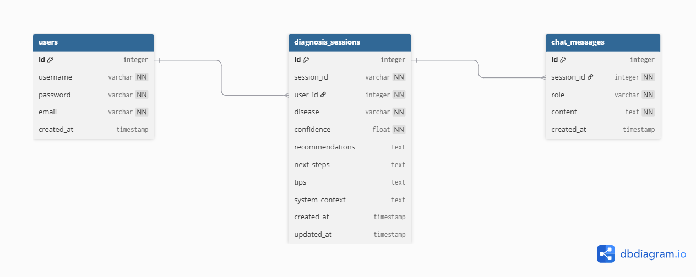

# 🏥 Skin Disease Analyzer

An AI-powered web application that analyzes skin images and provides disease recommendations using **EfficientNet CV model** combined with **Google Gemini LLM** for intelligent medical insights.

---

## ✨ Features

- 📸 **Image Analysis** - Upload skin images for instant AI analysis
- 🤖 **AI-Powered** - Combines Computer Vision + Large Language Models
- 💬 **Multi-turn Chat** - Ask follow-up questions about your diagnosis
- 👤 **User Authentication** - Secure login/register system
- 📋 **Chat History** - Save and revisit past analysis sessions
- 📱 **Modern UI** - Beautiful responsive interface with Streamlit
- 🐳 **Docker Ready** - Easy deployment with Docker containers

---

## � Initial Setup

### Clone the Repository

1. **Create a folder** for the project (e.g., on your Desktop or Documents):
   ```bash
   mkdir Skin-Disease-Detection
   cd Skin-Disease-Detection
   ```

2. **Open in VS Code:**
   ```bash
   code .
   ```
   Or use File → Open Folder in VS Code

3. **Clone the repository:**
   ```bash
   git clone https://github.com/shafaqarefin/Skin-Disease-Detection-and-Intelligent-advising-System.git .
   ```
   (Note: The `.` at the end clones into the current directory)

4. **Verify the structure:**
   ```bash
   ls
   # You should see: backend, frontend, training, README.md, LICENSE
   ```

---

## 🖥️ Backend Setup

### Option 1: Local Development (Recommended for Testing)

#### Prerequisites
- Python 3.11
- pip/conda
- Git
- **EfficientNet Models** - Download from [Google Drive](https://drive.google.com/drive/folders/1tReaIM4Gju7Aa64bta5iQT_BmkSNfP2_?usp=sharing) and extract the `model/` folder to the `backend/` directory

#### Step 1: Download Models
1. Open the [Google Drive link](https://drive.google.com/drive/folders/1tReaIM4Gju7Aa64bta5iQT_BmkSNfP2_?usp=sharing)
2. Download the `model` folder (contains `model_v1.h5`, `model_v2.h5`, `model_v3.h5`)
3. Extract it to your backend directory:
   ```
   backend/
   ├── model/
   │   ├── __init__.py
   │   ├── model_v1.h5
   │   ├── model_v2.h5
   │   └── model_v3.h5
   ```

#### Step 2: Setup Backend
```bash
# Navigate to backend directory
cd backend

# Create virtual environment
py -3.11 -m venv .venv

# Activate virtual environment
# On Windows:
.\.venv\Scripts\activate
# On macOS/Linux:
source .venv/bin/activate

# Install dependencies
pip install -r requirements.txt

# Create .env file with your Gemini API key
echo GEMINI_API_KEY=your_api_key_here > .env

# Run the backend
uvicorn app.main:app --reload --port 8000
```

The API will be available at: `http://localhost:8000`

---

### Option 2: Docker Deployment (Easiest - Pre-built Image) ⭐ RECOMMENDED

The Docker image is already built and uploaded to Docker Hub with all models included. This is the **fastest way** to get the backend running!

#### Pull and Run Pre-built Image
```bash
# Pull the pre-built image (includes all models)
docker pull shafaqarefin/skin-disease-api:latest

# Run the container
docker run -p 8000:8000 \
  -e GEMINI_API_KEY=your_api_key_here \
  shafaqarefin/skin-disease-api:latest
```

The backend API will be available at: `http://localhost:8000`

✅ **Advantages:**
- No need to download models separately
- No build time needed
- Image is optimized and tested
- Just pull and run!

---

## 🎨 Frontend Setup

#### Prerequisites
- Python 3.11
- pip/conda
- Backend API running (from Backend Setup above)

#### Setup Steps
```bash
# Navigate to frontend directory (in a NEW terminal)
cd frontend

# Create virtual environment
py -3.11 -m venv venv

# Activate virtual environment
# On Windows:
.\venv\Scripts\activate

#Gitbash on Windows
source venv/Scripts/activate

# On macOS/Linux:
source venv/bin/activate

# Install dependencies
pip install -r requirements.txt

# Run Streamlit app
streamlit run app.py
```

The frontend will open at: `http://localhost:8501`

Make sure your backend is running on `http://localhost:8000` before starting the frontend!

---

##  Database Schema



---

## �📖 API Documentation

### API Swagger docs
```
http://localhost:8000/docs
```

### Base URL
```
http://localhost:8000
```

### Analysis Endpoints

#### Analyze Skin Image
```http
POST /analyze_skin
Content-Type: multipart/form-data

Parameters:
- file: [image file] (Required)
- user_id: 1 (Query parameter, Required)
```

**Response (200):**
```json
{
  "session_id": "550e8400-e29b-41d4-a716-446655440000",
  "disease": "Melanoma",
  "confidence": 0.92,
  "recommendations": "This condition requires immediate professional evaluation. Please consult a dermatologist as soon as possible.",
  "next_steps": "Schedule an appointment with a dermatologist within 1-2 weeks for proper diagnosis and treatment.",
  "tips": "Avoid sun exposure. Use SPF 50+ sunscreen. Monitor changes in size, shape, or color.",
  "system_context": "You are an expert AI dermatology assistant..."
}
```

---

### Chat Endpoints

#### Send Chat Message
```http
POST /chat
Content-Type: application/json

{
  "user_id": 1,
  "session_id": "550e8400-e29b-41d4-a716-446655440000",
  "disease": "Melanoma",
  "confidence": 0.92,
  "message": "Should I see a dermatologist immediately?",
  "history": []
}
```

**Response (200):**
```json
{
  "response": "Yes, you should schedule an appointment with a dermatologist as soon as possible.",
  "history": [
    {
      "role": "user",
      "content": "Should I see a dermatologist immediately?"
    },
    {
      "role": "assistant",
      "content": "Yes, you should schedule an appointment with a dermatologist as soon as possible."
    }
  ]
}
```

---

#### Get User Sessions
```http
GET /auth/sessions/{user_id}
```

**Response (200):**
```json
{
  "user_id": 1,
  "sessions": [
    {
      "session_id": "550e8400-e29b-41d4-a716-446655440000",
      "disease": "Melanoma",
      "confidence": 0.92,
      "created_at": "2024-04-10T10:30:00",
      "messages": [...]
    }
  ]
}
```

---

#### Get Specific Session
```http
GET /auth/session/{session_id}
```

**Response (200):**
```json
{
  "session_id": "550e8400-e29b-41d4-a716-446655440000",
  "user_id": 1,
  "disease": "Melanoma",
  "confidence": 0.92,
  "system_context": "...",
  "messages": [
    {
      "role": "user",
      "content": "..."
    },
    {
      "role": "assistant",
      "content": "..."
    }
  ]
}
```

---

### Authentication Endpoints

#### Register
```http
POST /auth/register
Content-Type: application/json

{
  "username": "john_doe",
  "email": "john@example.com",
  "password": "secure_password"
}
```

**Response (200):**
```json
{
  "user_id": 1,
  "username": "john_doe",
  "email": "john@example.com",
  "message": "User registered successfully"
}
```

---

#### Login
```http
POST /auth/login
Content-Type: application/json

{
  "username": "john_doe",
  "password": "secure_password"
}
```

**Response (200):**
```json
{
  "user_id": 1,
  "username": "john_doe",
  "token": "jwt_token_here"
}
```

---

### Health Check
```http
GET /
```

**Response:**
```json
{
  "status": "healthy",
  "message": "API is up and running!"
}
```

---

## 📁 Project Structure

```
Skin Disease Recommendation Project/
├── backend/
│   ├── app/
│   │   ├── main.py              # FastAPI application
│   │   ├── api/
│   │   │   ├── routes.py        # Analysis endpoints
│   │   │   └── auth_routes.py   # Authentication endpoints
│   │   ├── core/
│   │   │   ├── config.py        # Configuration settings
│   │   │   ├── database.py      # Database connection
│   │   │   └── models.py        # SQLAlchemy models
│   │   ├── prompts/
│   │   │   ├── analysis_prompt.py
│   │   │   └── chat_prompt.py
│   │   ├── schemas/
│   │   │   ├── auth.py          # Auth request/response models
│   │   │   └── responses.py     # API response models
│   │   ├── services/
│   │   │   ├── llm_service.py   # Gemini API integration
│   │   │   ├── database_service.py
│   │   │   └── prediction_service.py
│   │   └── utils/
│   ├── model/
│   │   ├── model_v1.h5         # EfficientNet models various versions
│   │   ├── model_v2.h5
│   │   └── model_v3.h5
│   ├── Dockerfile
│   ├── requirements.txt
│   └── .env
├── frontend/
│   ├── app.py                  # Streamlit application
│   └── requirements.txt
├── training/
│   ├── training_v1.ipynb       # Model training notebooks various versions
│   └── training_v2.ipynb
└── README.md
```

---

## 🔧 Configuration

Create a `.env` file in the backend directory:

```env
GEMINI_API_KEY=your_api_key_here
```

---

## 🛠️ Tech Stack

| Component | Technology |
|-----------|-----------|
| **Backend** | FastAPI, Python 3.11 |
| **Frontend** | Streamlit |
| **CV Model** | EfficientNet B7 (TensorFlow) |
| **LLM** | Google Gemini API |
| **Database** | SQLite (easily swappable) |
| **Deployment** | Docker |

---

## 🔐 Security Notes

- Never commit `.env` file to version control
- Use environment variables for sensitive data
- API key is passed at runtime, not baked into Docker image
- Implement HTTPS in production
- Use secure session management

---

## 📝 Usage Example

### Via Web Interface
1. Go to `http://localhost:8501`
2. Register or login
3. Upload a skin image
4. Wait for analysis results
5. Ask follow-up questions in the chat

### Via API
```bash
# Analyze an image
curl -X POST "http://localhost:8000/analyze_skin?user_id=1" \
  -F "file=@skin_image.jpg"

# Send a chat message
curl -X POST "http://localhost:8000/chat" \
  -H "Content-Type: application/json" \
  -d '{
    "user_id": 1,
    "session_id": "550e8400-e29b-41d4-a716-446655440000",
    "disease": "Melanoma",
    "confidence": 0.92,
    "message": "What should I do?"
  }'
```


